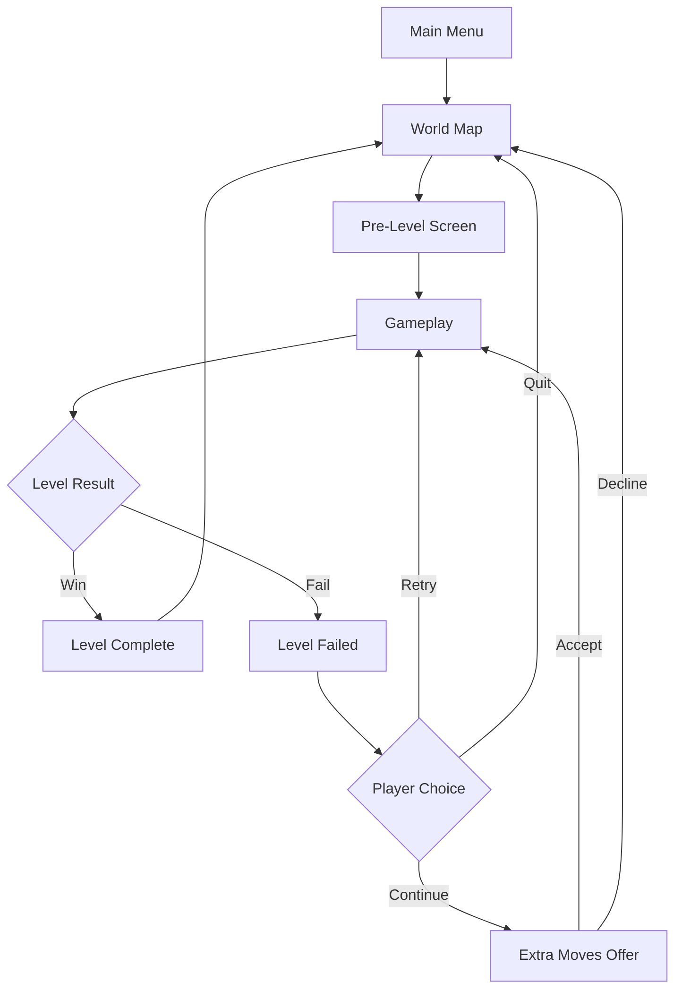
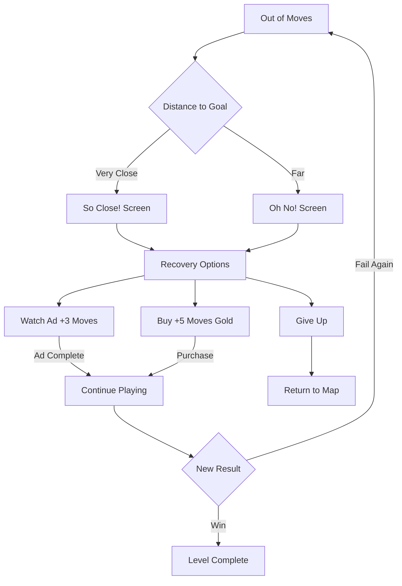

# Match-3 Game Design Guide

A comprehensive reference document for designing match-3 puzzle games, based on industry best practices and analysis of successful titles like Candy Crush Saga, Royal Match, and Gardenscapes.

---

## Table of Contents

1. [Overview and Core Loop](#1-overview-and-core-loop)
2. [Level Types and Win Conditions](#2-level-types-and-win-conditions)
3. [Level Design Principles](#3-level-design-principles)
4. [Difficulty Design and Curves](#4-difficulty-design-and-curves)
5. [Scoring and Star System](#5-scoring-and-star-system)
6. [Blockers and Obstacles](#6-blockers-and-obstacles)
7. [Special Pieces and Power-ups](#7-special-pieces-and-power-ups)
8. [Metagame Flow and UI Screens](#8-metagame-flow-and-ui-screens)
9. [Lives and Energy Systems](#9-lives-and-energy-systems)
10. [World Map and Progression](#10-world-map-and-progression)
11. [Testing and Balancing](#11-testing-and-balancing)
12. [Monetization Overview](#12-monetization-overview)
13. [References and Sources](#13-references-and-sources)

---

## 1. Overview and Core Loop

### What is a Match-3 Game?

A match-3 game is a tile-matching puzzle game where players swap adjacent pieces on a grid to create alignments of three or more identical items. When matched, these pieces are removed from the board, new pieces fall from above, and players progress toward level objectives. The genre originated with games like Shariki (1994) and was popularized by Bejeweled (2001) before Candy Crush Saga (2012) revolutionized the mobile gaming market.

Match-3 games dominate the casual gaming market due to their:
- **Low barrier to entry**: Simple mechanics anyone can understand
- **Short session length**: Perfect for mobile gaming in spare moments
- **Scalable depth**: Easy to learn, difficult to master
- **Universal appeal**: Appeals across age groups and demographics

### The Core Loop

The fundamental gameplay cycle consists of five interconnected phases:

```
┌─────────────────────────────────────────────────────────────┐
│                      THE CORE LOOP                          │
│                                                             │
│   ┌──────────┐    ┌──────────┐    ┌──────────┐             │
│   │RECOGNIZE │───▶│   SWAP   │───▶│  MATCH   │             │
│   │          │    │          │    │          │             │
│   └──────────┘    └──────────┘    └──────────┘             │
│        ▲                               │                    │
│        │                               ▼                    │
│   ┌──────────┐                   ┌──────────┐              │
│   │ PROGRESS │◀──────────────────│ CASCADE  │              │
│   │          │                   │          │              │
│   └──────────┘                   └──────────┘              │
│                                                             │
└─────────────────────────────────────────────────────────────┘
```

1. **Recognize**: Player scans the board for potential matches and strategic opportunities
2. **Swap**: Player executes a swap between two adjacent pieces
3. **Validate**: Game checks if the swap creates a valid match
   - **Valid Match** → Proceed to Match phase
   - **Invalid Swap** → Pieces swap back (revert animation), no move consumed, return to Recognize
4. **Match**: Game removes matching pieces (3+ in a row)
5. **Cascade**: Gravity fills gaps, potentially creating chain reactions
6. **Progress**: Player advances toward the level objective

This loop repeats until the player either completes the objective (win) or runs out of moves/time (fail).

> **Implementation Note (Invalid Swaps):** An invalid swap plays a "swap and revert" animation but does **not** consume a move. Some implementations strictly prevent invalid swaps at the UI level (pieces won't swap at all). For AI/bot testing, this distinction matters: invalid swaps cost time but not move currency.

### Psychological Hooks

Match-3 games leverage several psychological principles to create engagement:

#### The Rule of Three
Three is the minimum number for pattern recognition while remaining achievable. It creates:
- A sense of order and completion
- Low enough threshold for frequent success
- Foundation for building larger, more rewarding combinations

#### Loss Aversion
Players feel losses more strongly than equivalent gains:
- "So close!" messaging when near completion
- Investment of moves creates commitment
- Extra moves purchases feel like protecting progress rather than buying wins

#### Variable Rewards (Skinner Box)
Random cascade chains create unpredictable reward patterns:
- Players cannot reliably predict outcomes
- Occasional "lucky" cascades trigger dopamine release
- Near-misses maintain hope and engagement
- Special piece creation feels earned even when partly luck-based

#### The Flow State
Well-designed levels maintain optimal challenge:
- Too easy = boredom
- Too hard = frustration
- Just right = engagement and "one more level" behavior

#### Completion Tendency
The Zeigarnik Effect drives players to finish what they started:
- Incomplete levels nag at players
- Progress bars and star systems encourage perfection
- Episode gates create milestone-seeking behavior

---

## 2. Level Types and Win Conditions

Modern match-3 games feature diverse level types to maintain variety and engagement. Data based on Candy Crush Saga analysis:

### Level Type Distribution

| Level Type | Percentage | Primary Mechanic |
|------------|------------|------------------|
| Mixed Mode | 37.91% | Combined objectives |
| Clearing (Layer) | 18.52% | Clear background layer |
| Collection Order | 15.05% | Collect specific items |
| Ingredient Drop | 11.18% | Transport items to exits |
| Path Clearing | 2.93% | Clear path for special items |
| Other/Special | 14.41% | Event-specific mechanics |

### Clearing Levels / Layer Levels (18.52%)

**Objective**: Clear all marked tiles from the board by making matches on top of them (e.g., "jelly" in Candy Crush, "grass" in other games).

**Design Characteristics**:
- Marked tiles can have 1-5 layers (each match removes one layer)
- Often placed in corners or isolated sections
- May be combined with blockers that protect marked areas
- Board shape can isolate targets in hard-to-reach areas

**Strategic Depth**:
- Players must plan routes to corner tiles
- Special pieces become essential for reaching isolated areas
- Color blast + line-clear combinations highly effective

**Difficulty Levers**:
- Number of layers on tiles
- Target placement (center vs. edges vs. corners)
- Board shape (bottlenecks, isolated sections)
- Move count allocation

### Ingredient Drop Levels (11.18%)

**Objective**: Bring special items (e.g., cherries, hazelnuts, crates) to designated exit points.

**Design Characteristics**:
- Ingredients fall with gravity but cannot be swapped
- Exit points typically at bottom of columns
- May have multiple ingredients and multiple exits
- Conveyor belts and teleporters add complexity

**Strategic Depth**:
- Players must create matches below ingredients
- Column management becomes critical
- Blockers in ingredient paths create chokepoints

**Difficulty Levers**:
- Number of ingredients
- Exit point locations
- Column width (narrow columns are harder)
- Obstacles in ingredient paths

### Collection Order Levels (15.05%)

**Objective**: Collect a specified number of particular items (gems, special pieces, or specific colors).

**Design Characteristics**:
- Orders may include regular colors, specials, or both
- Multiple orders can be active simultaneously
- Some orders only completable via specific special combinations
- Order UI prominently displays remaining requirements

**Common Order Types**:
- Collect X red gems
- Create X striped pieces
- Create and activate X color blasts
- Collect X items from matching bomb pieces

**Difficulty Levers**:
- Order quantity requirements
- Order complexity (easy colors vs. rare specials)
- Color distribution on board
- Blockers preventing special creation

### Mixed Mode Levels (37.91%)

**Objective**: Complete multiple objective types within a single level.

**Design Characteristics**:
- Most common level type in modern match-3 games
- Combines 2-3 objectives from other level types
- Creates layered strategic decisions
- Often features phase-based progression

**Common Combinations**:
- Clear layers AND collect ingredients
- Collection order AND clear layers
- Bring ingredients AND collect orders

**Design Philosophy**:
- Primary objective controls core challenge
- Secondary objectives add texture and decision points
- Balance ensures neither objective trivializes the other

### Path Clearing Levels (2.93%)

**Objective**: Clear a path for special items to travel from spawn to exit points (e.g., "Rainbow Rapids" in Candy Crush).

**Design Characteristics**:
- Special items spawn on one side, must reach the other
- Blockers obstruct the path
- Time pressure as new items spawn
- Unique flowing mechanic distinct from other levels

**Strategic Depth**:
- Path planning and clearing
- Prioritizing obstructions
- Managing item queue

### Discontinued Level Types

#### Moves Levels
**Original Design**: Complete objective within limited moves.
**Status**: Effectively merged into all level types (moves are now universal).

#### Timed Levels
**Original Design**: Complete objective within time limit.
**Status**: Largely discontinued due to:
- Stressful gameplay experience
- Incompatible with interruption-friendly mobile gaming
- Poor monetization (harder to sell "more time" than "more moves")
- Accessibility concerns

### Fail Conditions

**Primary Fail Condition**: Running out of moves before completing all objectives.

**Secondary Fail Conditions**:
- Timed bomb explodes (timer reaches zero)
- Spreading blocker fills the board (rare)
- Special event conditions (time-limited events)

**Near-Fail Recovery Options**:
- Purchase extra moves (primary monetization)
- Watch advertisement for moves
- Use booster to clear remaining objectives

---

## 3. Level Design Principles

### MasterSheet Planning System

Professional match-3 studios use comprehensive tracking systems for level management:

#### MasterSheet Components

| Column | Purpose | Example Values |
|--------|---------|----------------|
| Level Number | Sequential identifier | 1, 2, 3... 5000+ |
| Episode | Grouping for narrative | "Forest World", "Ocean Area" |
| Level Type | Primary objective | Clearing, Order, Mixed |
| Difficulty Target | Intended pass rate | 80%, 50%, 30% |
| New Element | Tutorial introduction | "First wrapped piece" |
| Blocker Set | Active obstacles | "Spreading blocker, 2-layer obstacle" |
| Move Count | Allocated moves | 15, 20, 25 |
| Star Thresholds | Score targets | 5000/15000/30000 |
| Design Notes | Special considerations | "Teaches L-shape matching" |
| Test Results | Bot/playtest data | "45% pass rate" |
| Status | Production state | Draft, Testing, Live |

#### Planning Workflow

1. **Plot difficulty curve** for episode (peaks and valleys)
2. **Assign level types** ensuring variety
3. **Plan element introductions** (one new thing at a time)
4. **Design individual levels** within framework
5. **Test and iterate** until metrics match targets
6. **Final polish** for visual appeal

### Visual Design Principles

#### Symmetry and Board Shape

Symmetric boards feel fair and balanced to players:

```
SYMMETRIC BOARD EXAMPLES:

Standard Square       T-Shape           Diamond
┌─────────────┐    ┌─────────────┐    ┌─────────────┐
│ ■ ■ ■ ■ ■ ■ │    │     ■ ■ ■   │    │     ■ ■     │
│ ■ ■ ■ ■ ■ ■ │    │     ■ ■ ■   │    │   ■ ■ ■ ■   │
│ ■ ■ ■ ■ ■ ■ │    │ ■ ■ ■ ■ ■ ■ │    │ ■ ■ ■ ■ ■ ■ │
│ ■ ■ ■ ■ ■ ■ │    │ ■ ■ ■ ■ ■ ■ │    │   ■ ■ ■ ■   │
│ ■ ■ ■ ■ ■ ■ │    │ ■ ■ ■ ■ ■ ■ │    │     ■ ■     │
└─────────────┘    └─────────────┘    └─────────────┘

Hourglass          Split             Cross
┌─────────────┐    ┌─────────────┐    ┌─────────────┐
│ ■ ■ ■ ■ ■ ■ │    │ ■ ■     ■ ■ │    │     ■ ■     │
│   ■ ■ ■ ■   │    │ ■ ■     ■ ■ │    │     ■ ■     │
│     ■ ■     │    │ ■ ■     ■ ■ │    │ ■ ■ ■ ■ ■ ■ │
│   ■ ■ ■ ■   │    │ ■ ■     ■ ■ │    │ ■ ■ ■ ■ ■ ■ │
│ ■ ■ ■ ■ ■ ■ │    │ ■ ■     ■ ■ │    │     ■ ■     │
└─────────────┘    └─────────────┘    └─────────────┘
```

**Asymmetric boards** should be used sparingly:
- Can feel unfair to players
- Require careful balancing
- May be used intentionally to create difficulty

#### Board Shape Variation

Different shapes serve different design purposes:

| Shape Type | Design Purpose | Player Experience |
|------------|----------------|-------------------|
| Standard rectangle | Baseline/tutorial | Familiar, comfortable |
| Narrow columns | Ingredient challenge | Focused, constrained |
| Wide sections | Special creation | Expansive, powerful |
| Isolated areas | Objective placement | Strategic planning |
| Bottlenecks | Traffic control | Tension, decision points |
| Split boards | Multiple fronts | Divided attention |

### Element Density and Introduction

#### The One New Thing Rule

Never introduce more than one new element per level:
- Players need time to learn mechanics
- Overlapping introductions cause confusion
- Tutorials should be implicit through level design

#### Element Introduction Curve

```
ELEMENT DENSITY CURVE (Simplified)

Complexity
    ▲
    │                               ┌────────────────
    │                         ┌────┘
    │                   ┌────┘
    │             ┌────┘
    │       ┌────┘
    │ ┌────┘
    │─┘
    └──────────────────────────────────────────────▶ Level
       Tutorial    Learning    Engaging    Standard
       (1-20)      (21-50)     (51-100)    (100+)
```

#### Introduction Sequence (Example)

| Level Range | New Elements |
|-------------|--------------|
| 1-5 | Basic matching only |
| 6-10 | Striped piece creation |
| 11-15 | Wrapped/bomb piece creation |
| 16-20 | Color blast creation |
| 21-25 | Single-layer clearing tiles |
| 26-30 | Multi-layer clearing tiles |
| 31-35 | Spreading blockers |
| 36-40 | Ingredients + exits |
| 41-50 | Special combinations |
| 51+ | Complex blockers |

### Move Allocation

#### Historical Evolution

| Era | Standard Moves | Philosophy |
|-----|----------------|------------|
| 2012-2015 | 40-50 moves | Forgiving, completion-focused |
| 2015-2018 | 25-35 moves | Balanced challenge |
| 2018-2022 | 18-25 moves | Tighter design |
| 2022-Present | 15-20 moves | Modern standard |

#### Modern Move Philosophy

Lower move counts:
- Create more meaningful decisions
- Increase special piece value
- Shorten session length
- Improve monetization (extra moves more valuable)
- Force strategic rather than tactical play

#### Move Count Guidelines

| Difficulty Target | Move Recommendation |
|-------------------|---------------------|
| Very Easy (90%+) | 25-30 moves |
| Easy (75-90%) | 20-25 moves |
| Medium (50-75%) | 15-20 moves |
| Hard (30-50%) | 12-18 moves |
| Very Hard (<30%) | 10-15 moves |

---

## 4. Difficulty Design and Curves

### Difficulty Bands

Professional match-3 design divides levels into distinct difficulty bands with different design goals:

#### Tutorial Band (Levels 1-20)

**Target Pass Rate**: 85-95% first attempt

**Design Goals**:
- Teach core mechanics
- Build confidence
- Establish gameplay vocabulary
- Zero frustration

**Characteristics**:
- Generous move counts
- Simple board shapes
- Single objectives
- Obvious solutions
- Celebration of small victories

#### Learning Band (Levels 21-50)

**Target Pass Rate**: 70-85% first attempt

**Design Goals**:
- Introduce special pieces
- Teach combination strategies
- Build strategic thinking
- Introduce first blockers

**Characteristics**:
- Moderate move constraints
- First complex board shapes
- Tutorial-lite for new elements
- Occasional challenge spikes

#### Engaging Band (Levels 51-100)

**Target Pass Rate**: 50-70% first attempt

**Design Goals**:
- Full mechanic usage
- Strategic depth
- "Mastery" moments
- Emotional variety

**Characteristics**:
- All special pieces available
- Multiple blockers per level
- Mixed objectives common
- First "hard" levels

#### Standard Band (Levels 100-500)

**Target Pass Rate**: 40-60% first attempt

**Design Goals**:
- Long-term engagement
- Consistent challenge
- Regular content consumption
- Revenue generation

**Characteristics**:
- Full blocker palette
- Complex combinations
- Event integration
- Periodic difficulty spikes

#### Expert Band (Levels 500+)

**Target Pass Rate**: 30-50% first attempt

**Design Goals**:
- Challenge dedicated players
- Demonstrate mastery
- Content for long-term users
- Prestige completion

**Characteristics**:
- Maximum complexity
- Minimal margin for error
- Requires optimal play
- Often requires boosters

### Level Outcome Categories

Every level should be designed with an intended outcome in mind. The two fundamental categories are:

#### Near Win Levels

**Definition**: Levels designed so players typically fail 3-5 moves away from victory.

**Characteristics**:
- Player can clearly see the win state was within reach
- Just a few more moves would have completed the objective
- Creates strong "I was so close!" feeling
- Highest monetization conversion rates

**Design Use**:
- Primary monetization driver ("Extra Moves" purchases)
- Most replayed level type
- Player believes skill can overcome the gap on retry
- 1-2 per episode for revenue optimization

```
Near Win (Monetization Driver):
┌─────────────────────────────────────┐
│ Objective: Clear 50 tiles           │
│ Result: Cleared 47 tiles            │
│ Moves left: 0                       │
│ Feeling: "So close! +5 moves?"      │
└─────────────────────────────────────┘
```

#### Near Miss Levels

**Definition**: Levels where players typically win on their very last moves.

**Characteristics**:
- Victory achieved with 0-2 moves remaining
- Creates tension throughout final moves
- Strong feeling of relief and accomplishment
- Player feels they "barely made it"

**Design Use**:
- Creates memorable victories
- Player feels skilled ("I clutched it!")
- High satisfaction despite tight margins
- Good for milestone/boss levels and episode finales

```
Near Miss (Satisfaction Driver):
┌─────────────────────────────────────┐
│ Objective: Clear 50 tiles           │
│ Result: Cleared 50 tiles ✓          │
│ Moves left: 1                       │
│ Feeling: "Yes! Just made it!"       │
└─────────────────────────────────────┘
```

#### Comfortable Win Levels

**Definition**: Levels where players win with moves to spare.

**Characteristics**:
- Victory with 3+ moves remaining
- Triggers End Bonus sequence
- Feels achievable and fair
- Lower replay rate

**Design Use**:
- Breather levels after difficult sections
- Tutorial and early-game levels
- Maintains player confidence and session length

### Emotional Pacing Types

Beyond outcome design, levels serve emotional pacing roles within an episode:

#### Breather Levels

**Purpose**: Provide relief and maintain session length.

**Characteristics**:
- High pass rate (80%+)
- Simple, satisfying mechanics
- Visual polish and feedback
- "Palette cleanser" after hard levels

**Design Notes**:
- Essential for pacing
- Players need wins to continue
- Good for introducing new mechanics safely

#### Skill Levels

**Purpose**: Reward dedicated players with challenges that feel fair.

**Characteristics**:
- Medium difficulty
- Clear strategic path
- Minimal RNG dependence
- Satisfaction from planning

**Design Notes**:
- Core of the experience
- Most levels should be this type
- Teaches advanced strategies

#### Spectacle Levels

**Purpose**: Create memorable moments and cascade satisfaction.

**Characteristics**:
- Spectacular chain reactions
- Special piece abundance
- Board-clearing combos
- Screen-filling explosions

**Design Notes**:
- 1 per episode maximum
- Screenshot/share moments
- Reinforces progression reward

> **Niche Term: "Fuu-Effect"**
>
> Some designers use "Fuu-Effect" (from Anton Heorhiiev's articles) to describe aggressive Near Win levels specifically designed to maximize frustration and monetization. These are Near Win levels tuned to the peak of the frustration curve—use sparingly (1-2 per episode) and always follow with a Breather level.

### Difficulty Curve Within Episodes

```
EPISODE DIFFICULTY PATTERN (15 levels)

Difficulty
    ▲
    │         ┌─┐
    │     ┌─┐ │ │   ┌─┐
    │   ┌─┘ └─┘ │ ┌─┘ │
    │ ┌─┘       └─┘   └─┐
    │─┘                  └─
    └──────────────────────▶ Level
       1   3   5   7   9  11  13  15

Level 1:  Easy opener (Comfortable Win / Breather)
Level 3:  First challenge (Skill)
Level 5:  Spike (Near Win)
Level 6:  Recovery (Breather)
Level 10: Mid-episode challenge (Skill)
Level 12: Hardest level (Near Win)
Level 13: Recovery (Breather)
Level 15: Satisfying finale (Near Miss / Spectacle)
```

### Automatic Difficulty Adjustment

Modern match-3 games implement invisible difficulty balancing:

#### Color Drop Probability

**Mechanism**: Adjust which colors spawn based on player state.

**When Struggling**:
- Increase probability of colors that create matches
- Slightly favor colors needed for objectives
- Improve cascade potential

**When Winning Easily**:
- Return to standard distribution
- No active hindering (players notice)

#### Pre-Made Combinations

**Mechanism**: Seed the board with near-matches.

**Implementation**:
- Starting board includes 0-3 pre-set matches
- Struggling players get better starting positions
- Hidden from player perception

#### Seed-Based Generation

**Mechanism**: Predetermined random sequences tested for fairness.

**Process**:
1. Generate random seed
2. Simulate thousands of games with seed
3. Measure win rates at different skill levels
4. Accept or reject seed based on targets
5. Serve appropriate seeds to players

> **Important Distinction: Seed Selection vs. Live RNG Manipulation**
>
> There is a critical difference between two approaches:
>
> | Approach | Description | Industry Stance |
> |----------|-------------|-----------------|
> | **Seed Selection** | Pre-test many seeds, serve easier/harder seeds based on player history | **Industry Standard** - Used by major studios |
> | **Live RNG Rigging** | Actively manipulate the next drop to block a win or force a failure | **Risky/Avoided** - Breaks player trust |
>
> Major studios (like King) publicly state they do **not** rig live RNG to force failures. Players are highly sensitive to perceived unfairness—if they suspect "the game cheated me," retention plummets. The safer approach is selecting from pre-validated seeds rather than manipulating drops in real-time.

### Bot-Driven Testing

Automated testing is essential for difficulty calibration:

#### Bot Types

| Bot Type | Purpose | Iterations |
|----------|---------|------------|
| Random | Baseline difficulty | 50-100 |
| Basic Strategy | Average player | 100-500 |
| Advanced | Skilled player | 200-500 |
| Optimal | Maximum skill | 500-1000+ |

#### Bot Strategy Levels

**Random Bot**: Selects valid moves randomly
- Tests: "Is level possible to fail?"
- Pass rate should be lower than target

**Basic Strategy Bot**: Prioritizes obvious matches
- Tests: Average player experience
- Pass rate should approximate target

**Advanced Bot**: Creates specials, plans combos
- Tests: Skilled player ceiling
- Pass rate should exceed target

**Optimal Bot**: Uses lookahead, all combinations
- Tests: Theoretical maximum
- Should pass nearly always

#### Interpreting Bot Data

| Bot Pass Rate | Interpretation | Action |
|---------------|----------------|--------|
| Random: 80%+ | Too easy | Reduce moves or add blockers |
| Basic: Below target | On track | Continue testing |
| Advanced: Below 90% | May be too hard | Consider adjustments |
| Optimal: Below 95% | Unfair RNG | Redesign required |

---

## 5. Scoring and Star System

> **Modern Design Note:** In contemporary hit games like *Royal Match*, **score is often irrelevant**. Players care about Pass/Fail, not point totals. Many modern games hide or remove the score display entirely to reduce UI clutter and speed up the loop. The star system may be shown only at level completion, or replaced with a simple binary "Level Cleared" state. The scoring systems below represent the traditional approach—implement them only if your game design specifically benefits from score-based progression or replayability goals.

### Star Thresholds

The three-star system provides replayability and mastery goals:

#### Star Distribution Guidelines

| Star | Score Target | Player Segment | Approximate Achievement |
|------|--------------|----------------|-------------------------|
| 1 Star | Minimum viable | All completers | 100% of wins |
| 2 Stars | Good performance | Engaged players | 60-70% of wins |
| 3 Stars | Excellence | Dedicated players | 20-30% of wins |

#### Threshold Calculation

```
ONE STAR:
  baseline_score = (moves * average_score_per_move * 0.7)
  One Star = baseline_score

TWO STARS:
  Two Stars = One Star * 2.0 to 2.5

THREE STARS:
  Three Stars = One Star * 3.5 to 4.5
```

#### Example Thresholds

| Level Type | 1 Star | 2 Stars | 3 Stars |
|------------|--------|---------|---------|
| Easy (25 moves) | 15,000 | 35,000 | 60,000 |
| Medium (20 moves) | 20,000 | 50,000 | 90,000 |
| Hard (15 moves) | 25,000 | 70,000 | 120,000 |

### Score Sources

#### Basic Scoring

| Action | Base Points | Notes |
|--------|-------------|-------|
| 3-match | 60 | 20 per gem |
| 4-match | 120 | 30 per gem |
| 5-match | 200 | 40 per gem |
| 6+ match | 300+ | Scales with length |

#### Cascade Multipliers

Each successive cascade in a chain increases scoring:

| Cascade Level | Multiplier | Example (3-match) |
|---------------|------------|-------------------|
| Initial match | 1.0x | 60 points |
| Cascade 1 | 1.5x | 90 points |
| Cascade 2 | 2.0x | 120 points |
| Cascade 3 | 2.5x | 150 points |
| Cascade 4+ | 3.0x | 180 points |

#### Special Piece Scoring

| Special Type | Creation Bonus | Activation Bonus |
|--------------|----------------|------------------|
| Striped | 120 | 60 per gem cleared |
| Wrapped | 200 | 100 per gem cleared (x2 for double explosion) |
| Color Blast | 200 | 60 per gem cleared |

#### Combination Scoring

| Combination | Bonus Points | Additional |
|-------------|--------------|------------|
| Striped + Striped | 3,000 | Plus gem clear points |
| Wrapped + Wrapped | 5,000 | Plus gem clear points |
| Striped + Wrapped | 6,000 | Plus gem clear points |
| Color Blast + Striped | 3,000 | Plus transformed gem points |
| Color Blast + Wrapped | 3,000 | Plus transformed gem points |
| Color Blast + Color Blast | 10,000 | Plus all gem points |

### End Bonus Mechanics

When a level is completed, remaining moves convert to points (called "Sugar Crush" in Candy Crush):

#### End Bonus Process

1. **Trigger**: Player completes all objectives
2. **Move Conversion**: Each remaining move generates effects
3. **Random Special**: Creates a random special piece per move
4. **Activation**: Special activates automatically
5. **Score Award**: 6,000 points per move (base)

#### End Bonus Value

| Remaining Moves | Base Points | With Cascades (Est.) |
|-----------------|-------------|----------------------|
| 1 | 6,000 | 8,000-15,000 |
| 5 | 30,000 | 50,000-80,000 |
| 10 | 60,000 | 100,000-180,000 |
| 15 | 90,000 | 150,000-300,000 |

### Activation Order

When multiple special pieces exist, they activate in a specific order:

```
SPECIAL PIECE ACTIVATION ORDER

1. LINE-CREATING SPECIALS (if present)
   └── Create striped patterns first

2. TARGETING SPECIALS (if present)
   └── Target objectives strategically

3. WRAPPED/BOMB PIECES
   └── Explode in creation order

4. STRIPED PIECES
   └── Clear rows/columns

5. COLOR BLASTS
   └── Activate last (may clear new specials)
```

**Design Rationale**:
- Line-creating specials generate more specials to activate
- Targeting specials provide strategic objective completion
- Wrapped explosion may create new matches
- Striped clears lines cleanly
- Color blasts benefit from other specials existing

---

## 6. Blockers and Obstacles

### Design Principles

Effective blocker design follows key principles:

#### Distinct Properties

Every blocker must have unique characteristics:
- **Clear identity**: Player instantly recognizes it
- **Specific counter**: Known way to defeat it
- **Unique challenge**: Creates distinct strategic consideration
- **Visual clarity**: Never ambiguous on board

#### Blocker Limit Per Level

**Rule of Three-Four**: Maximum 3-4 blocker types per level

**Rationale**:
- More blockers create visual noise
- Player cognitive load increases
- Strategic depth has diminishing returns
- Each blocker needs space to "breathe"

#### Document Incompatibilities

Certain blocker combinations create poor gameplay:

| Combination | Problem |
|-------------|---------|
| Spreading Blockers + Many Spawners | Board fills too quickly |
| Timed Bombs + Narrow Columns | Unfair pressure |
| Spreading + Movement | Chaotic, frustrating |
| High-layer Obstacles + Low Moves | Feels impossible |

### Blocker Catalog

#### Locking Blockers

Blockers that immobilize pieces:

| Blocker Type | Layers | Counter | Design Use |
|---------|--------|---------|------------|
| **Chains/Ropes** | 1-2 | Match locked piece | Lock high-value pieces |
| **Locks** | 1 | Match or special | Quick obstruction |
| **Ice/Freeze** | 1-3 | Match frozen piece | Protect valuable pieces |
| **Encasing** | 1-2 | Match encased piece | Semi-transparent lock |

**Design Notes**:
- Locking blockers create "rescue" gameplay
- Place on special pieces for tension
- Use to protect objectives from accidental completion

#### Spreading Blockers

Blockers that multiply if not contained:

| Blocker Type | Spread Rate | Counter | Design Use |
|---------|-------------|---------|------------|
| **Standard Spreading** (e.g., Chocolate) | 1/turn if no match | Adjacent match | Time pressure |
| **Fast Spreading** (e.g., Dark Chocolate) | 2/turn if no match | Adjacent match | High pressure |
| **Covering Type** (e.g., Moss, Slime) | Covers matches | Direct match | Persistent threat |

**Design Notes**:
- Creates urgency and panic
- Forces reactive gameplay
- Use spawners/fountains to control spawn
- Always provide escape path

#### Immovable Blockers

Static obstacles requiring specific clearing:

| Blocker Type | Layers | Counter | Design Use |
|---------|--------|---------|------------|
| **Layered Obstacle** (e.g., Frosting, Ice) | 1-5 | Adjacent match | Progressive clearing |
| **Breakable Wall** | 1-3 | Adjacent match | Similar to layered |
| **Single-hit Obstacle** | 1 | Match on it | Simple obstacle |
| **Line Blocker** | 1 | Adjacent match | Line blocking |

**Design Notes**:
- Shape the playable board
- Create bottlenecks
- Protect objectives
- Guide player attention

#### Spawners

Elements that continuously produce obstacles:

| Spawner Type | Produces | Rate | Counter |
|---------|----------|------|---------|
| **Blocker Fountain** | Spreading blockers | 1/turn | Block adjacent space |
| **Multi-Type Spawner** | Various blockers | Variable | Often unkillable |
| **Piece Generator** | Specific pieces | 1/turn | N/A (beneficial) |
| **Objective Spreader** | Collectible tiles | 1/turn | N/A (objective) |

**Design Notes**:
- Creates ongoing pressure
- Forces area control
- Can be positive (piece generator) or negative
- Carefully balance spawn rate

#### Timed Blockers

Blockers with countdown mechanics:

| Blocker Type | Timer Range | Consequence | Counter |
|---------|-------------|-------------|---------|
| **Countdown Bomb** | 1-99 moves | Level fail | Match or special |
| **Spreading Timer** | 3-10 moves | Spreads | Match before timer |
| **Event Timer** | Event-specific | Level fail | Complete objective |

**Design Notes**:
- Creates hard deadlines
- Forces prioritization
- Timer should be fair (minimum 5-8 moves)
- Never spawn bomb at 1

#### Movement Blockers

Blockers that move around the board:

| Blocker Type | Movement Pattern | Counter | Design Use |
|---------|------------------|---------|------------|
| **Wandering Destroyer** (e.g., Tornado) | Random each turn | Special piece | Chaos element |
| **Rotator** | Rotates pieces | N/A | Position disruption |
| **Mobile Collector** (e.g., Frog) | Hops after eating | Collect for use | Mobile special |

**Design Notes**:
- Add unpredictability
- Use sparingly (frustrating if overused)
- Ensure fair interaction windows

#### Multi-tile Blockers

Blockers occupying multiple cells:

| Blocker Type | Size | Counter | Design Use |
|---------|------|---------|------------|
| **Large Obstacle** (e.g., Cake Bomb) | 2x2 | 8 adjacent matches | Boss-like obstacle |
| **Locked Container** (e.g., Chest) | 1x2 or 2x1 | Key piece match | Gate mechanic |
| **Multi-cell Breakable** | 2x2 | 4 matches | Area clearing |
| **Floating Obstacle** | 1x2 | Special piece | Ingredient variant |

**Design Notes**:
- Create focal points
- Require sustained effort
- Good for level centerpieces
- Often telegraph strategy

### Blocker Interaction Matrix

```
BLOCKER COMPATIBILITY MATRIX
(✓ = Good, ~ = Caution, ✗ = Avoid)

              │ Lock │ Spread │ Immov │ Spawn │ Timed │ Move │ Multi │
──────────────┼──────┼────────┼───────┼───────┼───────┼──────┼───────┤
Locking       │  ✓   │   ~    │   ✓   │   ✓   │   ~   │  ✗   │   ✓   │
Spreading     │  ~   │   ✗    │   ~   │   ✗   │   ✗   │  ✗   │   ~   │
Immovable     │  ✓   │   ~    │   ✓   │   ✓   │   ✓   │  ~   │   ✓   │
Spawners      │  ✓   │   ✗    │   ✓   │   ~   │   ✗   │  ✗   │   ✓   │
Timed         │  ~   │   ✗    │   ✓   │   ✗   │   ✗   │  ✗   │   ~   │
Movement      │  ✗   │   ✗    │   ~   │   ✗   │   ✗   │  ✗   │   ✗   │
Multi-tile    │  ✓   │   ~    │   ✓   │   ✓   │   ~   │  ✗   │   ✓   │
```

---

## 7. Special Pieces and Power-ups

### Special Piece Creation

Special pieces reward skillful matching with powerful abilities:

#### Creation Conditions

| Pattern | Result | Orientation |
|---------|--------|-------------|
| 4 in a horizontal row | Vertical Striped | Clears column |
| 4 in a vertical column | Horizontal Striped | Clears row |
| 5 in L-shape | Wrapped/Bomb | 3x3 explosion (x2) |
| 5 in T-shape | Wrapped/Bomb | 3x3 explosion (x2) |
| 5 in a straight line | Color Blast | Clears all of one color |
| 6+ in line | Color Blast | Same as 5-line |

#### Visual Pattern Reference

```
STRIPED PIECE CREATION (4 in a row)

Horizontal (creates VERTICAL striped):
┌───┬───┬───┬───┐
│ ● │ ● │ ● │ ● │  →  Clears COLUMN when activated
└───┴───┴───┴───┘

Vertical (creates HORIZONTAL striped):
┌───┐
│ ● │
├───┤
│ ● │  →  Clears ROW when activated
├───┤
│ ● │
├───┤
│ ● │
└───┘

WRAPPED/BOMB PIECE CREATION (L or T shape)

L-Shapes:
┌───┬───┬───┐      ┌───┐          ┌───┐          ┌───┬───┬───┐
│ ● │ ● │ ● │      │ ● │          │ ● │          │ ● │ ● │ ● │
├───┼───┼───┤      ├───┤          ├───┤          └───┴───┼───┤
│   │   │ ● │      │ ● │          │ ● │                  │ ● │
└───┴───┼───┤      ├───┼───┬───┐  └───┼───┬───┐          ├───┤
        │ ● │      │ ● │ ● │ ● │      │ ● │ ● │          │ ● │
        └───┘      └───┴───┴───┘      └───┴───┘          └───┘

T-Shape:
    ┌───┐
    │ ● │
┌───┼───┼───┐
│ ● │ ● │ ● │
└───┼───┼───┘
    │ ● │
    └───┘

COLOR BLAST CREATION (5 in a line)

┌───┬───┬───┬───┬───┐
│ ● │ ● │ ● │ ● │ ● │  →  Matches ALL of swapped color
└───┴───┴───┴───┴───┘
```

### Combination Effects

Swapping two special pieces together creates powerful combinations:

#### Combination Matrix

| Swap | Effect | Visual |
|------|--------|--------|
| **Striped + Striped** | Clears row AND column in cross pattern | + shape |
| **Wrapped + Wrapped** | 5x5 explosion (larger radius) | Big bang |
| **Striped + Wrapped** | Clears 3 rows AND 3 columns | Giant cross |
| **Color Blast + Regular** | Clears all pieces of that color | Color clear |
| **Color Blast + Striped** | All matching colors become striped, then activate | Mass stripes |
| **Color Blast + Wrapped** | All matching colors become wrapped, then explode | Mass explosions |
| **Color Blast + Color Blast** | Clears entire board | Total clear |

#### Combination Power Rankings

| Combination | Relative Power | Best Use |
|-------------|----------------|----------|
| Color Blast + Color Blast | 10 | Emergency clear |
| Color Blast + Wrapped | 9 | Massive damage |
| Color Blast + Striped | 8 | Line clearing |
| Striped + Wrapped | 8 | Area clear |
| Wrapped + Wrapped | 6 | Central damage |
| Striped + Striped | 5 | Cross pattern |
| Color Blast + Regular | 4 | Color removal |

### Pre-Level Boosters

Boosters purchased/selected before level start:

| Booster | Effect | Typical Cost |
|---------|--------|--------------|
| **+5 Moves** | Extra moves to complete level | Low |
| **Color Blast Start** | Begin with color blast on board | Medium |
| **Striped + Wrapped Start** | Begin with combination | Medium |
| **Targeted Hammer** | Adds hammer to use during level | High |
| **Free Switch** | One free swap without move cost | Low |

### In-Game Boosters

Boosters usable during gameplay:

| Booster | Effect | Activation |
|---------|--------|------------|
| **Targeted Hammer** | Destroys any single piece | Tap target |
| **Free Switch** | Swap any two pieces | Drag |
| **Wrapped Bomb** | Place wrapped anywhere | Tap location |
| **Color Blast** | Place color blast anywhere | Tap location |

### System Events (Not Boosters)

These are automatic failsafe mechanics, not purchasable boosters:

| System Event | Trigger | Behavior |
|--------------|---------|----------|
| **Auto-Shuffle** | No valid moves available | Board reshuffles automatically at no cost |
| **Hint System** | Player idle for X seconds | Highlights a valid move |
| **Reshuffle Limit** | Multiple reshuffles in one level | After 2-3 reshuffles, level may auto-fail or redesign is needed |

> **Design Note:** Making players pay to fix a broken board (no-moves state) is considered poor design in modern games. Shuffle should be a free, automatic system recovery—not a monetization opportunity.

### Booster Design Philosophy

**Effective Boosters**:
- Provide clear, immediate value
- Don't trivialize level design
- Create strategic decisions (when to use)
- Feel fair to non-paying players

**Booster Economy**:
- Earnable through gameplay
- Purchasable with premium currency
- Limited quantity encourages strategic use
- Never mandatory for completion

---

## 8. Metagame Flow and UI Screens

### Core Screen Flow

The player journey through the game follows this structure:



### Level Failed Dialog Flow

The level failed experience is critical for monetization and retention:



### Screen Descriptions

#### Main Menu Screen

**Primary Functions**:
- Game title/branding
- Play button (direct to last level)
- Settings access
- Daily reward notification
- Event banners

**Design Considerations**:
- Minimize friction to gameplay
- Show current progress/level
- Highlight limited-time events
- Quick session start option

#### World Map Screen

**Primary Functions**:
- Level selection
- Progress visualization
- Episode/area navigation
- Social features (friend progress)
- Event entry points

**Key Elements**:
- Current level highlighted
- Star count per level
- Episode gates visible
- Friend avatars on map
- Event icons

**Navigation**:
- Scroll to view progression
- Tap level to enter pre-level
- Episode selection for quick travel
- Return to specific areas

#### Pre-Level Screen

**Primary Functions**:
- Display level objectives
- Booster selection
- Difficulty indicator (if any)
- Start button

**Key Elements**:
- Objective icons with counts
- Booster slots (3-5)
- Move count display
- Play button
- Back to map option

**Booster Selection**:
- Show owned quantities
- Quick purchase option
- Recommended boosters
- Combination suggestions

#### Gameplay Screen

**Primary Functions**:
- Game board display
- Objective tracking
- Move counter
- Score display
- Pause/settings access

**Layout Priorities**:
1. Board (central, largest element)
2. Objectives (top, always visible)
3. Moves remaining (prominent)
4. Score (secondary)
5. Pause/boosters (accessible but not distracting)

**Responsive Considerations**:
- Portrait: Objectives top, board center, boosters bottom
- Landscape: Objectives side, board center, boosters side

#### Level Complete Screen

**Primary Functions**:
- Victory celebration
- Score summary
- Star display
- Continue/replay options

**Key Elements**:
- Star animation (1-3 stars)
- Final score
- High score comparison
- Next level button
- Replay for more stars option

**Celebration Sequence**:
1. Victory message
2. Star award animation
3. Score tally
4. Continue prompt

#### Level Failed Screen

**Primary Functions**:
- Soft failure messaging
- Recovery options
- Retry/quit choices
- Monetization opportunity

**Key Elements**:
- Encouraging message ("So close!" vs "Try again!")
- Distance to goal visualization
- Extra moves purchase
- Ad watch option
- Retry button
- Return to map

**Recovery Options Priority**:
1. Watch ad (free to player)
2. Spend soft currency
3. Spend premium currency
4. Retry from beginning
5. Quit to map

---

## 9. Lives and Energy Systems

### Standard Lives System

The traditional match-3 lives system:

#### Core Mechanics

| Parameter | Standard Value | Variation Range |
|-----------|----------------|-----------------|
| Maximum lives | 5 | 3-8 |
| Regeneration time | 30 minutes | 15-60 minutes |
| Life cost per attempt | 1 | Always 1 |
| Full refill time | 2.5 hours | 1-4 hours |

#### Lives Economy

```
LIVES REGENERATION TIMELINE

Full (5 lives)
    │
    ├── Fail level (lose 1) ────────────────▶ 4 lives
    │                                            │
    │   30 min regeneration                      ▼
    │   ◄───────────────────────────────── 5 lives
    │
    ├── Fail again ─────────────────────────▶ 4 lives
    │
    └── Continue playing...

OUT OF LIVES OPTIONS:
    ┌─────────────────────────────────────┐
    │         No Lives Remaining          │
    ├─────────────────────────────────────┤
    │  [Wait 30:00 for 1 life]            │
    │  [Ask friends for lives]            │
    │  [Watch ad for 1 life]              │
    │  [Buy 5 lives - 10 gold]            │
    │  [Buy unlimited lives - 1hr]        │
    └─────────────────────────────────────┘
```

### Social Lives Features

Lives create social engagement opportunities:

#### Friend Requests (Legacy Model)

**Sending Lives**:
- Request lives from friends (limited daily)
- Friends receive notification
- One-tap sending reciprocates

**Receiving Lives**:
- Accept lives from friends
- Lives can exceed maximum (temporary)
- Creates reciprocity obligation

> **Note:** The Facebook-friend model is declining. Modern games increasingly rely on **Team Systems** (see below) as the primary social engine.

#### Leaderboards and Competition

**Friend Progress**:
- See friend levels on map
- Compare scores on levels
- Send help to stuck friends

### Team Systems (Modern Primary Social Engine)

Teams (also called Clans or Clubs) have become the **single biggest retention driver** in modern match-3 games, replacing Facebook friend integration as the primary social mechanic.

#### Core Team Features

| Feature | Description | Retention Impact |
|---------|-------------|------------------|
| **Team Lives** | Request lives from teammates (replaces Facebook friends) | High - daily engagement |
| **Team Chests** | Collective rewards for team activity | High - shared goals |
| **Team Tournaments** | Compete as a group against other teams | Very High - competitive drive |
| **Team Chat** | In-game communication | Medium - community building |
| **Team Levels** | Team XP and unlockable perks | Medium - progression |

#### Team Chest Mechanics

```
TEAM CHEST PROGRESSION

Team members complete levels
         │
         ▼
    ┌─────────────┐
    │ Chest fills │ ◄── Each level completion adds points
    │   [████░░]  │
    └─────────────┘
         │
         ▼ (When full)
    ┌─────────────┐
    │  REWARDS    │ ◄── All team members receive rewards
    │ (Coins,     │     (Even if they didn't contribute)
    │  Boosters,  │
    │  Lives)     │
    └─────────────┘
```

#### Why Teams Outperform Friend Systems

| Old Model (Friends) | New Model (Teams) |
|---------------------|-------------------|
| Requires Facebook login | In-game only |
| Friends may not play | Teammates are active players |
| No shared goals | Team chests create collective goals |
| Passive social (view progress) | Active social (compete together) |
| One-way requests | Reciprocal team benefits |

### Purpose of Lives System

Lives serve multiple design purposes:

#### Session Pacing

**Problem**: Players might play indefinitely without breaks
**Solution**: Natural session end points
**Benefit**: Prevents burnout, maintains long-term engagement

#### Return Triggers

**Problem**: Players may forget to return to game
**Solution**: Push notifications when lives refill
**Benefit**: Re-engagement at optimal times

#### Monetization

**Problem**: Need revenue while keeping game fair
**Solution**: Sell lives/time to impatient players
**Benefit**: Revenue without pay-to-win

#### Social Engagement

**Problem**: Single-player games lack social hooks
**Solution**: Friend-based lives economy
**Benefit**: Viral growth, community building

### Alternative Energy Systems

Some games use variations:

| System | Mechanic | Example Games |
|--------|----------|---------------|
| **Stamina** | Points spent per level, variable | RPG-hybrids |
| **Keys** | Currency for specific areas | Royal Match |
| **Tickets** | Event-specific energy | Event modes |
| **Moves Pool** | Total moves across levels | Some casual games |

---

## 10. World Map and Progression

> **Modern Design Alternative: The "Fast Loop"**
>
> Traditional match-3 games feature elaborate scrolling world maps with parallax layers and detailed art. However, the current market leader (*Royal Match*) succeeded by **minimizing the map entirely**—just a "Play" button and a background image. This "Fast Loop" approach:
> - Reduces friction between levels
> - Speeds up session starts
> - Lowers art production costs
> - Keeps focus on core gameplay
>
> A complex scrolling map is an **artistic choice**, not a strict requirement. Consider your target audience and production budget when deciding map complexity.

### Episode Structure

Games are divided into episodes/worlds for manageable progression:

#### Standard Episode Length

| Parameter | Common Value | Range |
|-----------|--------------|-------|
| Levels per episode | 15-20 | 10-25 |
| Episodes at launch | 10-15 | 5-20 |
| Episodes total (mature game) | 500+ | 200-1000+ |

#### Episode Content Breakdown

```
TYPICAL EPISODE (15 levels)

Level 1: Easy opener, minimal blockers
Level 2-3: Tutorial for episode's new element
Level 4-5: Practice with new element
Level 6-7: First challenge levels
Level 8: Breather level
Level 9-10: Intermediate difficulty
Level 11-12: Hard levels (difficulty spike)
Level 13: Breather
Level 14: Boss-level (hardest)
Level 15: Satisfying finale (wow-effect)
```

### Gates and Unlocking

Gates separate episodes and create progression milestones:

#### Gate Types

| Gate Type | Unlock Method | Design Purpose |
|-----------|---------------|----------------|
| **Star Gates** | Collect X total stars | Encourage replaying |
| **Quest Gates** | Complete specific challenges | Tutorial mechanics |
| **Social Gates** | Get help from friends | Viral sharing |
| **Time Gates** | Wait for unlock | Pacing, anticipation |
| **Payment Gates** | Purchase unlock | Monetization |

#### Gate Design Philosophy

**Good Gates**:
- Feel achievable (not punishing)
- Encourage desirable behavior
- Provide natural break points
- Create anticipation

**Bad Gates**:
- Feel arbitrary or unfair
- Block for too long
- Require excessive grinding
- Pay-only options

### Map Art Design Process

Creating world map visuals follows a structured pipeline:

#### Stage 1: Concept

**Deliverables**: Theme mood board, key landmarks
**Considerations**:
- Fits game's overall aesthetic
- Distinct from previous episodes
- Clear visual identity
- Progression-appropriate

#### Stage 2: Layout

**Deliverables**: Level placement, path flow
**Considerations**:
- Logical path through environment
- Visual variety in terrain
- Space for decorative elements
- Technical constraints (scrolling)

#### Stage 3: Blocking

**Deliverables**: Rough environment shapes
**Considerations**:
- Landmark visibility
- Level node placement
- Foreground/background separation
- Interactive areas

#### Stage 4: Detail

**Deliverables**: Full art assets
**Considerations**:
- Consistent art style
- Animation-ready elements
- Parallax layers
- Performance optimization

#### Stage 5: Polish

**Deliverables**: Final map with effects
**Considerations**:
- Ambient animations
- Particle effects
- Sound design
- Level state visuals (complete/incomplete)

### Map Visual Hierarchy

```
MAP LAYER STRUCTURE (Back to Front)

┌────────────────────────────────────────┐
│  SKY / DISTANT BACKGROUND              │  Parallax: Slowest
├────────────────────────────────────────┤
│  MOUNTAINS / HORIZON                   │  Parallax: Slow
├────────────────────────────────────────┤
│  MAIN ENVIRONMENT                      │  Parallax: Medium
├────────────────────────────────────────┤
│  PATH AND LEVEL NODES                  │  Parallax: Base
├────────────────────────────────────────┤
│  DECORATIVE ELEMENTS                   │  Parallax: Base
├────────────────────────────────────────┤
│  FOREGROUND ELEMENTS                   │  Parallax: Fast
├────────────────────────────────────────┤
│  UI OVERLAY                            │  Fixed
└────────────────────────────────────────┘
```

---

## 11. Testing and Balancing

### Playtest Protocol

Systematic human testing is essential for difficulty calibration:

#### Standard Playtest Process

**Plays Per Level**: Minimum 10 unique playtests

**Tester Selection**:
- Mix of skill levels
- Some familiar with match-3, some new
- Include target demographic
- Avoid designers/developers

**Test Conditions**:
- No hints or assistance
- Fresh level (no previous attempts)
- Standard device/platform
- No boosters unless testing boosters

#### Playtest Data Collection

| Metric | How to Measure | Target Range |
|--------|----------------|--------------|
| Pass Rate | Wins / Total Attempts | Varies by difficulty band |
| Moves Used | Average on successful plays | Should approach limit |
| Stars Achieved | Distribution of 1/2/3 stars | Based on design intent |
| Time to Complete | Average play duration | 2-5 minutes typical |
| Frustration Score | 1-5 player rating | Below 3 for standard levels |

### Key Metrics

#### Difficulty Percentage

**Definition**: Percentage of players who complete level on first attempt

**Calculation**:
```
Difficulty % = (First-Attempt Wins / Total First Attempts) * 100
```

**Target Ranges by Band**:
| Band | Target Difficulty % |
|------|---------------------|
| Tutorial | 85-95% |
| Learning | 70-85% |
| Engaging | 50-70% |
| Standard | 40-60% |
| Expert | 25-45% |

#### Dropout Rate

**Definition**: Percentage of players who quit level without completing

**Calculation**:
```
Dropout % = (Quits / Total Attempts) * 100
```

**Red Flags**:
- Dropout > 20%: Level may be frustrating
- Dropout on first move: Bad starting board
- Dropout near completion: Unfair RNG

#### Attempts Before Win

**Definition**: Average number of tries to complete level

**Target Ranges**:
| Difficulty | Target Attempts |
|------------|-----------------|
| Easy | 1.0-1.2 |
| Medium | 1.3-1.8 |
| Hard | 2.0-3.0 |
| Very Hard | 3.0-5.0 |

### A/B Testing Framework

Continuous optimization through controlled experiments:

#### What to A/B Test

| Variable | Test Approach |
|----------|---------------|
| Move count | +/- 2 moves between variants |
| Blocker placement | Alternative positions |
| Board shape | Minor variations |
| Star thresholds | Different score targets |
| Booster prompts | Different offers |

#### A/B Test Process

1. **Hypothesis**: "Reducing moves by 2 will increase monetization without hurting retention"
2. **Segments**: Split players randomly (50/50 or other)
3. **Metrics**: Define success criteria before test
4. **Duration**: Run until statistical significance
5. **Analysis**: Compare metrics between groups
6. **Decision**: Roll out winner or iterate

#### Sample Size Requirements

| Confidence Level | Minimum Players Per Variant |
|------------------|----------------------------|
| 90% | 1,000 |
| 95% | 2,000 |
| 99% | 5,000 |

### Problem Identification

#### Red Flags Indicating Level Problems

| Signal | Possible Cause | Investigation |
|--------|----------------|---------------|
| Pass rate too low | Not enough moves | Try +3 moves |
| Pass rate too high | Too many moves | Try -3 moves |
| High dropout | Frustrating mechanic | Watch playtest recordings |
| Low star 3 rate | Threshold too high | Adjust score target |
| High star 3 rate | Threshold too low | Adjust score target |
| Long play times | Board too large | Reduce playable area |
| Short play times | Board too small | Increase playable area |
| Bot passes, humans fail | Execution vs recognition | Simplify patterns |
| Humans pass, bot fails | Luck-dependent | Reduce RNG |

#### Level Fix Checklist

When a level shows problem metrics:

1. **Verify the problem**: Run additional tests
2. **Identify the cause**: Watch playtest recordings
3. **Propose fix**: Single variable change
4. **Implement fix**: Update level
5. **Retest**: Confirm improvement
6. **Document**: Record change and result

---

## 12. Monetization Overview

This section provides a brief overview of monetization strategies in match-3 games. The focus is on design integration rather than aggressive monetization tactics.

### Common Monetization Vectors

| Vector | Implementation | Player Perception |
|--------|----------------|-------------------|
| **Extra Moves** | Buy 3-5 moves when out | High value if close to win |
| **Lives** | Buy refill or unlimited time | Convenience purchase |
| **Boosters** | Pre-level or in-game tools | Power purchase |
| **Cosmetics** | Themes, avatars, effects | Self-expression |
| **Ad Removal** | One-time purchase | Quality of life |

### Progressive Offers (Dynamic Sales Funnel)

Modern games don't show a static "Buy +5 Moves" button. The "Out of Moves" screen is a **dynamic sales funnel** that escalates offers based on player behavior:

```
PROGRESSIVE OFFER ESCALATION

First Failure:
┌────────────────────────────┐
│  "So close! Keep going?"   │
│  [+5 Moves - 10 coins]     │
│  [Watch Ad - +3 Moves]     │
│  [Give Up]                 │
└────────────────────────────┘

Second Failure (same level):
┌────────────────────────────┐
│  "You've almost got it!"   │
│  [+5 Moves + Bomb - 15 coins]  │
│  [Watch Ad - +3 Moves]     │
│  [Give Up]                 │
└────────────────────────────┘

Third+ Failure:
┌────────────────────────────┐
│  "Special offer just for you!" │
│  [+15 Moves + 2 Bombs - 25 coins] │
│  [Watch Ad - +5 Moves]     │
│  [Give Up]                 │
└────────────────────────────┘
```

**Key Design Principles**:
- Offers improve with each failure (more moves, added boosters)
- Price increases but value increases faster
- Ad rewards also escalate to maintain free path
- Never make the first offer the best offer

### Design Philosophy

#### Core Principle: Beatable Without Spending

Every level should be completable without spending money:
- Skill should matter more than purchases
- Patience (waiting for lives) is always an option
- Boosters are shortcuts, not requirements

#### Avoid Pay-to-Win

**Good Practice**:
- Purchases accelerate progress
- Purchases reduce frustration
- Purchases enhance expression

**Bad Practice**:
- Purchases required to progress
- Levels designed to force spending
- Dramatic advantage for spenders

### Fair Monetization Checklist

- [ ] All levels completable with skill alone
- [ ] Free-to-play path clearly viable
- [ ] Purchases feel like choices, not requirements
- [ ] Difficulty not artificially inflated for monetization
- [ ] Clear value proposition for purchases
- [ ] No predatory practices targeting vulnerable users
- [ ] Transparent about odds for random purchases

---

## 13. References and Sources

### LinkedIn Articles

**Anton Heorhiiev** (Game Designer):
- "Match-3 Level Design: A Deep Dive"
- "Understanding Candy Crush's Difficulty Curve"
- "Blocker Design in Puzzle Games"

### Studio Guides

**Room 8 Studio**:
- Match-3 Design Documentation
- Level Design Best Practices
- Blocker Interaction Guidelines

**Playrix** (Game World Observer Interview):
- Difficulty calibration methodologies
- Bot testing frameworks
- Player segmentation strategies

**VSquad Games**:
- Match-3 Feature Prioritization
- Live Operations Strategies

**RocketBrush Studio**:
- Map Art Pipeline
- World Building for Match-3

**Melior Games**:
- Technical Match-3 Implementation
- Performance Optimization

### Wiki Resources

**Candy Crush Saga Wiki** (Fandom):
- Comprehensive blocker documentation
- Special candy mechanics
- Level type breakdowns
- Historical game evolution

### Game Developer Articles

**Gamasutra/Game Developer**:
- "The Psychology of Match-3"
- "Designing World Maps for Casual Games"
- "Balancing F2P Puzzle Games"

### Additional Resources

**GDC Talks**:
- King presentation on Candy Crush design
- Playrix talks on puzzle game balancing
- Wooga sessions on casual game retention

**Academic Papers**:
- Juul, J. - "A Casual Revolution" (Match-3 genre analysis)
- Pattern matching in game design research

---

## Appendix A: Quick Reference Tables

### Level Type Quick Reference

| Type | Objective | Key Strategy | Common Boosters |
|------|-----------|--------------|-----------------|
| Clearing | Clear marked tiles | Work from corners | Striped, Wrapped |
| Ingredient | Drop items to exits | Clear below items | Striped |
| Order | Collect items | Create required specials | Color Blast |
| Mixed | Multiple goals | Prioritize harder goal | All types |

### Special Piece Quick Reference

| Pattern | Creates | Activation |
|---------|---------|------------|
| 4 horizontal | V-Striped | Clears column |
| 4 vertical | H-Striped | Clears row |
| L or T (5) | Wrapped | 3x3 explosion x2 |
| 5 line | Color Blast | Clears all of color |

### Difficulty Targets Quick Reference

| Band | Levels | Pass Rate Target |
|------|--------|------------------|
| Tutorial | 1-20 | 85-95% |
| Learning | 21-50 | 70-85% |
| Engaging | 51-100 | 50-70% |
| Standard | 100-500 | 40-60% |
| Expert | 500+ | 30-50% |

---

## Appendix B: Changelog

| Version | Date | Changes |
|---------|------|---------|
| 1.0 | Initial | Document created |

---

*This document is intended as a reference guide for game designers working on match-3 puzzle games. It consolidates industry knowledge and best practices from multiple sources. For specific implementation details, consult your game's technical documentation.*
